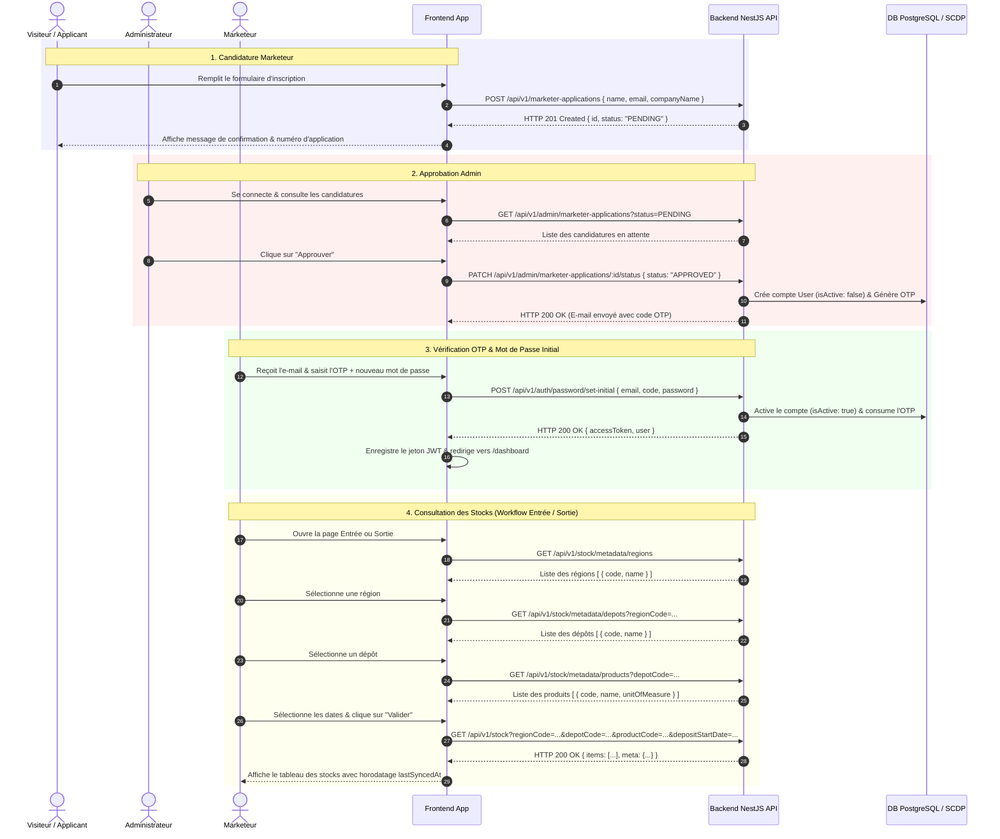

# Spécification d'Intégration Frontend & Contrat API Backend SCDP

Document de référence faisant autorité pour l'équipe de développement frontend. Rédigé sur la base d'une analyse rigoureuse et exhaustive du code source backend NestJS / Prisma (`scdp-backend`).

---

## 1. Résumé de l'Architecture Backend (Backend Architecture Summary)

Le backend de la plateforme SCDP est développé avec **NestJS** (TypeScript) et utilise l'ORM **Prisma** relié à une base de données **PostgreSQL**.

### Informations Clés de l'Architecture
* **Base URL / Préfixe Global** : `/api/v1` (toutes les routes d'API sont préfixées par `/api/v1`).
* **Origine CORS Autorisée** : `http://localhost:5173` avec support des identifiants (`credentials: true`).
* **Documentation OpenAPI / Swagger** : Accessible à l'URL `http://localhost:3000/docs`.
* **Validation des Entrées** : Le backend applique un pipe global `ValidationPipe` avec les options :
  * `whitelist: true` : supprime automatiquement les champs non définis dans le DTO.
  * `transform: true` : transforme automatiquement les types des données reçues (ex: chaînes en nombres).
  * `forbidNonWhitelisted: true` : rejette la requête avec une erreur `400 Bad Request` si des propriétés inattendues sont envoyées.
* **Format des Réponses de Succès (Interceptor Global `ResponseInterceptor`)** :
  Toute réponse HTTP réussie (2xx) est systématiquement enveloppée dans le format standard :
  ```json
  {
    "success": true,
    "data": { ... }
  }
  ```
* **Format des Réponses d'Erreur (Filtre Global `GlobalExceptionFilter`)** :
  Toute exception interceptée produit une réponse au format JSON unifié :
  ```json
  {
    "success": false,
    "message": "Description lisible de l'erreur",
    "code": "CODE_D_ERREUR_MAJUSCULE",
    "statusCode": 400,
    "timestamp": "2026-08-17T16:09:17.000Z",
    "path": "/api/v1/..."
  }
  ```

---

## 2. Architecture d'Authentification (Authentication Architecture)

L'authentification repose sur des jetons sans état **JWT (JSON Web Token)** transmis via l'en-tête HTTP standard `Authorization`.

### Mécanisme de Jeton
* **Format de l'En-tête** : `Authorization: Bearer <access_token>`
* **Contenu du Payload JWT (`JwtPayload`)** :
  ```json
  {
    "sub": "user_id_cuid",
    "email": "user@example.com",
    "role": "MARKETER" | "ADMIN",
    "iat": 1786982957,
    "exp": 1787069357
  }
  ```
* **Endpoints d'Authentification** :
  * `POST /api/v1/auth/login` : Authentification et obtention du jeton JWT.
  * `GET /api/v1/auth/me` : Récupération du profil de l'utilisateur connecté.
  * `POST /api/v1/auth/refresh` : Renouvellement du jeton JWT pour une session active.
  * `POST /api/v1/auth/logout` : Déconnexion côté client (stateless).
* **Maintien de l'État d'Authentification par le Frontend** :
  * Stocker le jeton d'accès `accessToken` dans le `localStorage` ou dans un état global réactif (`Pinia`, `Redux`, `Zustand`).
  * Attacher automatiquement le header `Authorization: Bearer <accessToken>` à chaque requête sortante exigeant une authentification via un intercepteur HTTP (ex: Axios / Fetch interceptor).
  * En cas de réponse `401 Unauthorized`, le frontend doit supprimer le jeton expiré et rediriger l'utilisateur vers la page de connexion.

---

## 3. Rôles Utilisateurs et Permissions (User Roles and Permissions)

Le système gère deux rôles principaux définis dans l'énumération Prisma `Role` :

| Rôle | Description | Accès aux Endpoints |
| :--- | :--- | :--- |
| `ADMIN` | Administrateur de la plateforme SCDP | Accès total : gestion des candidatures, gestion des marketeurs, déclenchement de la synchronisation, consultation des logs de sync, notifications admin et consultation des stocks. |
| `MARKETER` | Marketeur pétrolier agréé | Accès restreint : consultation du profil, mise en place du mot de passe initial, consultation des stocks (Entrée / Sortie), métadonnées des dépôts/régions/produits et notifications personnelles. |

### Enforcement des Droits côté Backend
Chaque route protégée est sécurisée par le garde `JwtAuthGuard` combiné au garde de rôles `RolesGuard`. La présence du décorateur `@Roles(Role.ADMIN)` ou `@Roles(Role.ADMIN, Role.MARKETER)` garantit que l'utilisateur possède le rôle adéquat. Le frontend doit adapter dynamiquement son menu et ses routes, mais le backend demeure la frontière de sécurité faisant autorité.

---

## 4. Flux de Demande d'Inscription Marketeur (Marketer Application Flow)

Lorsqu'un visiteur non authentifié accède au site web, il peut soumettre une demande de création de compte marketeur.

### A. Soumission de la Candidature
* **URL de l'Endpoint** : `POST /api/v1/marketer-applications`
* **Authentification** : Aucune (Publique).
* **Corps de la Requête (`CreateApplicationDto`)** :
  ```json
  {
    "name": "Jean Dupont",
    "email": "jean.dupont@societe-petrole.cm",
    "companyName": "Société Pétrolière du Cameroun SA"
  }
  ```
* **Règles de Validation Backend** :
  * `name` : Chaîne de caractères non vide.
  * `email` : Adresse e-mail valide, obligatoire.
  * `companyName` : Chaîne de caractères non vide, obligatoire.
* **Traitement Backend** :
  1. Vérifie si une candidature `PENDING` ou `APPROVED` existe déjà pour cet e-mail (renvoie `409 ConflictException` le cas échéant avec le message : `"An active marketer application already exists for this email address."`).
  2. Vérifie si un compte utilisateur existe déjà avec cet e-mail (renvoie `409 Conflict` : `"A user account with this email address already exists."`).
  3. Enregistre la candidature avec le statut `PENDING`.
  4. Crée une notification in-app pour le rôle `ADMIN` ("New Marketer Application").
  5. Envoie un e-mail de confirmation d'enregistrement au candidat via `EmailService.sendApplicationSubmittedEmail`.
* **Réponse de Succès (HTTP 201 Created)** :
  ```json
  {
    "success": true,
    "data": {
      "id": "cm7...cuid",
      "name": "Jean Dupont",
      "email": "jean.dupont@societe-petrole.cm",
      "companyName": "Société Pétrolière du Cameroun SA",
      "status": "PENDING",
      "rejectionReason": null,
      "createdAt": "2026-08-17T16:09:17.000Z",
      "updatedAt": "2026-08-17T16:09:17.000Z"
    }
  }
  ```

### B. Suivi du Statut de la Candidature par le Candidat
* **URL de l'Endpoint** : `GET /api/v1/marketer-applications/track/:email`
* **Authentification** : Aucune (Publique).
* **Paramètre de Chemin** : `email` (ex: `jean.dupont@societe-petrole.cm`).
* **Réponse de Succès (HTTP 200 OK)** :
  ```json
  {
    "success": true,
    "data": {
      "id": "cm7...",
      "name": "Jean Dupont",
      "email": "jean.dupont@societe-petrole.cm",
      "companyName": "Société Pétrolière du Cameroun SA",
      "status": "PENDING", // ou "APPROVED" ou "REJECTED"
      "rejectionReason": null, // ou motif de rejet si REJECTED
      "createdAt": "2026-08-17T16:09:17.000Z",
      "updatedAt": "2026-08-17T16:09:17.000Z"
    }
  }
  ```
* **Erreur (HTTP 404 Not Found)** : Si aucune candidature n'est associée à cet e-mail.

---

## 5. Flux de Vérification et Validation Admin (Admin Verification Flow)

L'administrateur passe en revue les demandes de création de compte marketeur.

### A. Liste des Candidatures
* **Endpoint** : `GET /api/v1/admin/marketer-applications`
* **Authentification** : Obligatoire (`ADMIN`).
* **Paramètres Query** :
  * `status` (optionnel) : `PENDING`, `APPROVED`, ou `REJECTED`.
  * `page` (optionnel, défaut `1`) : Numéro de page.
  * `limit` (optionnel, défaut `10`) : Nombre d'éléments par page.
* **Réponse de Succès (HTTP 200 OK)** :
  ```json
  {
    "success": true,
    "data": {
      "items": [
        {
          "id": "cm7...",
          "name": "Jean Dupont",
          "email": "jean.dupont@societe-petrole.cm",
          "companyName": "Société Pétrolière du Cameroun SA",
          "status": "PENDING",
          "rejectionReason": null,
          "createdAt": "2026-08-17T16:09:17.000Z",
          "updatedAt": "2026-08-17T16:09:17.000Z"
        }
      ],
      "meta": {
        "total": 1,
        "page": 1,
        "limit": 10,
        "totalPages": 1,
        "hasNextPage": false,
        "hasPreviousPage": false
      }
    }
  }
  ```

### B. Approbation ou Rejet d'une Candidature
* **Endpoint** : `PATCH /api/v1/admin/marketer-applications/:id/status`
* **Authentification** : Obligatoire (`ADMIN`).
* **Corps de la Requête (`UpdateApplicationStatusDto`)** :
  * **Cas Approbation** :
    ```json
    {
      "status": "APPROVED"
    }
    ```
  * **Cas Rejet** :
    ```json
    {
      "status": "REJECTED",
      "rejectionReason": "Pièces justificatives d'agrément manquantes"
    }
    ```
* **Comportement Backend lors d'une Approbation** :
  1. Met à jour le statut de la candidature à `APPROVED`.
  2. Crée automatiquement le compte utilisateur `User` avec `role: MARKETER`, `isActive: false` (compte inactif en attente d'initialisation du mot de passe) et un hash de mot de passe temporaire.
  3. Génère un code OTP de vérification à 6 chiffres (type `ACCOUNT_VERIFICATION`, validité 15 minutes).
  4. Envoie l'e-mail d'approbation contenant le code OTP au marketeur.
  5. Crée une notification in-app destinée au marketeur.
* **Comportement Backend lors d'un Rejet** :
  1. Exige le motif `rejectionReason` (renvoie `400 Bad Request` s'il est manquant).
  2. Met à jour le statut à `REJECTED` et enregistre le motif.
  3. Envoie l'e-mail de rejet avec le motif au candidat.

---

## 6. Flux de Création de Compte Marketeur (Account Creation Flow)

Le compte utilisateur marketeur est créé automatiquement par le backend lors de la validation administrative ou directement créé par l'admin via l'API de gestion des marketeurs (`POST /api/v1/admin/marketers`).

### Attributs du Compte Créé lors de l'Approbation
* `name` : Nom du candidat
* `email` : Adresse e-mail du candidat
* `role` : `MARKETER`
* `isActive` : `false` (devient `true` après la saisie réussie du mot de passe initial avec l'OTP)
* `passwordHash` : Hash temporaire sécurisé

---

## 7. Flux de Vérification du Code OTP (OTP Verification Flow)

À la suite de l'approbation de sa candidature, le marketeur reçoit un e-mail contenant un code OTP à 6 chiffres.

### Spécifications Techniques du Système OTP
* **Longueur du Code** : 6 chiffres numériques.
* **Durée de Validité** : 15 minutes.
* **Limite de Tentatives** : 5 tentatives de saisie invalides au maximum. À la 5ème erreur, le code est bloqué et l'utilisateur doit en demander un nouveau.
* **Vérification Implémentée par le Backend** :
  * Endpoint d'envoi / renvoi d'OTP : `POST /api/v1/auth/otp/send`
  * Endpoint de pré-vérification d'OTP : `POST /api/v1/auth/otp/verify`
* **Exemple de Demande / Renvoi d'OTP (`SendOtpDto`)** :
  ```json
  {
    "email": "jean.dupont@societe-petrole.cm",
    "type": "ACCOUNT_VERIFICATION" // ou "PASSWORD_RESET"
  }
  ```
* **Exemple de Vérification d'OTP (`VerifyOtpDto`)** :
  ```json
  {
    "email": "jean.dupont@societe-petrole.cm",
    "code": "482910",
    "type": "ACCOUNT_VERIFICATION"
  }
  ```
* **Réponse de Succès de la Vérification (HTTP 200 OK)** :
  ```json
  {
    "success": true,
    "data": {
      "success": true,
      "message": "OTP verified successfully. You may proceed to password creation."
    }
  }
  ```

---

## 8. Flux de Création du Mot de Passe Initial (Initial Password Flow)

Après vérification de l'OTP, le marketeur doit définir son mot de passe pour activer définitivement son compte et se connecter.

* **Endpoint de Configuration Initiale du Mot de Passe** : `POST /api/v1/auth/password/set-initial`
* **Authentification** : Aucune (Publique, la preuve de possession est le code OTP).
* **Corps de la Requête (`SetInitialPasswordDto`)** :
  ```json
  {
    "email": "jean.dupont@societe-petrole.cm",
    "code": "482910",
    "password": "MonMotDePasseSecurise123!"
  }
  ```
* **Règles de Validation Backend** :
  * `email` : Adresse e-mail valide, obligatoire.
  * `code` : Exactement 6 chiffres.
  * `password` : Au moins 6 caractères.
* **Traitement Backend** :
  1. Vérifie l'OTP pour l'e-mail et le type `ACCOUNT_VERIFICATION`.
  2. Chiffre le nouveau mot de passe avec `bcrypt` (10 rounds).
  3. Met à jour le compte `User` : définit `passwordHash` et passe `isActive` à `true`.
  4. Consomme (supprime) le code OTP répertorié.
  5. Génère immédiatement un jeton d'accès JWT pour connecter automatiquement l'utilisateur.
* **Réponse de Succès (HTTP 200 OK)** :
  ```json
  {
    "success": true,
    "data": {
      "success": true,
      "message": "Initial password set up successfully. Account is now active.",
      "accessToken": "eyJhbGciOiJIUzI1NiIsInR5cCI6...",
      "user": {
        "id": "cm7...",
        "name": "Jean Dupont",
        "email": "jean.dupont@societe-petrole.cm",
        "role": "MARKETER"
      }
    }
  }
  ```

---

## 9. Exigences du Tableau de Bord (Dashboard Requirements)

Une fois authentifié, le marketeur est redirigé vers son tableau de bord principal.

### Données Requises pour le Tableau de Bord
* **Profil Utilisateur Courant** : Récupéré via `GET /api/v1/auth/me`.
* **Notifications Non Lues** : Récupérées via `GET /api/v1/notifications?limit=5`.
* **Métadonnées Globales de Stock** :
  * Régions géographiques : `GET /api/v1/stock/metadata/regions`
  * Dépôts disponibles : `GET /api/v1/stock/metadata/depots`
  * Produits pétroliers disponibles : `GET /api/v1/stock/metadata/products`
* **Synthèse Récente des Stocks** : `GET /api/v1/stock?limit=10` pour afficher les dernières entrées/sorties enregistrées.

---

## 10. Workflow Entrée en Stock (Entrance Workflow)

Le workflow "Entrée en stock" permet au marketeur de consulter les réceptions et dépôts de produits pétroliers liquides par région, dépôt, produit et période.

### Séquence de Sélection et d'Appel d'APIs

```
Étape 1: Sélection de la Région 
  └─► GET /api/v1/stock/metadata/regions
      Récupère la liste des codes et noms de régions disponibles.

Étape 2: Sélection du Dépôt
  └─► GET /api/v1/stock/metadata/depots?regionCode={regionCode}
      Filtre les dépôts appartenant à la région sélectionnée.

Étape 3: Sélection du Type de Produit
  └─► GET /api/v1/stock/metadata/products?depotCode={depotCode}
      Filtre les produits pétroliers disponibles dans le dépôt sélectionné.

Étape 4: Sélection des Dates d'Entrée (Départ / Fin)
  └─► Choix des dates au format ISO 8601 (ex: depositStartDate, depositEndDate).

Étape 5: Validation & Exécution de la Requête de Stock
  └─► GET /api/v1/stock?regionCode={regionCode}&depotCode={depotCode}&productCode={productCode}&depositStartDate={startDate}&depositEndDate={endDate}&page=1&limit=10
```

### Données Affichées dans les Résultats d'Entrée
* Code et Nom du Produit (`productCode`, `productName`)
* Nom du Dépôt (`depotName`) et Code Région (`regionCode`)
* Quantité Disponible (`availableQuantity`)
* Unité de Mesure (`unitOfMeasure` - ex: Litres, M3)
* Date de Dépôt / Réception (`depositDate`)
* Statut du Stock (`status`)
* Date de dernière synchronisation (`lastSyncedAt`)

---

## 11. Workflow Sortie de Stock (Sortie Workflow)

Le workflow "Sortie en stock" réutilise le même moteur de données de stock backend, mais applique des filtres axés sur les enlévements et dispatches (`removalDate`).

### Séquence de Sélection et d'Appel d'APIs

```
Étape 1: Sélection de la Région 
  └─► GET /api/v1/stock/metadata/regions

Étape 2: Sélection du Dépôt
  └─► GET /api/v1/stock/metadata/depots?regionCode={regionCode}

Étape 3: Sélection du Type de Produit
  └─► GET /api/v1/stock/metadata/products?depotCode={depotCode}

Étape 4: Sélection des Dates de Sortie / Enlèvement
  └─► Choix des dates (removalStartDate, removalEndDate).

Étape 5: Validation & Exécution de la Requête
  └─► GET /api/v1/stock?regionCode={regionCode}&depotCode={depotCode}&productCode={productCode}&removalStartDate={startDate}&removalEndDate={endDate}&page=1&limit=10
```

### Différence Clé entre Entrée et Sortie
* **Entrée** : Filtre sur la plage de dates de dépôt `depositStartDate` / `depositEndDate` (propriété backend `depositDate`).
* **Sortie** : Filtre sur la plage de dates d'enlèvement `removalStartDate` / `removalEndDate` (propriété backend `removalDate`).

---

## 12. Système de Notifications (Notifications)

Le backend offre un module complet de gestion des notifications in-app pour les administrateurs et les marketeurs.

* **Liste des Notifications Utilisateur** : `GET /api/v1/notifications?page=1&limit=10`
  * Récupère les notifications destinées soit à l'identifiant de l'utilisateur (`userId`), soit à son rôle (`role`).
  * Renvoie le nombre de messages non lus (`unreadCount`).
* **Marquer une Notification comme Lue** : `PATCH /api/v1/notifications/:id/read`
* **Marquer Toutes les Notifications comme Lues** : `PATCH /api/v1/notifications/read-all`
* **Déclencheurs Automatiques de Notifications Backend** :
  * Nouvelle candidature soumise -> Notification pour les utilisateurs `ADMIN`.
  * Candidature approuvée -> Notification pour le compte `MARKETER` créé.

---

## 13. Synchronisation de la Base de Données SCDP (Database Synchronization)

Les données de stock proviennent directement de la base de données source SCDP et sont synchronisées de manière unidirectionnelle dans la base de données de l'application.

### Règles d'Intégration et Immuabilité des Données
1. **Données Lecture Seule (Read-Only)** : Les éléments du modèle `StockItem` (produits, dépôts, quantités, dates de dépôt/enlèvement) sont strictly **en lecture seule** pour le frontend et l'application. Le frontend ne doit proposer **aucun formulaire de création ou d'édition directe de stocks**.
2. **Fraîcheur des Données (`lastSyncedAt`)** : Chaque enregistrement de stock comporte l'horodatage `lastSyncedAt`. Le frontend doit afficher cette date pour informer le marketeur de l'heure exacte de la dernière mise à jour des stocks.
3. **Déclenchement Manuel (Admin Only)** : L'administrateur peut exécuter `POST /api/v1/sync/trigger` pour lancer la synchronisation à la demande.
4. **Historique des Syncs** : `GET /api/v1/sync/history` permet à l'admin de visualiser les réussites, échecs, durées et volumes de données synchronisés.

---

## 14. Catalogue Complet des Endpoints API (Complete API Endpoint Catalog)

Voici l'inventaire exhaustif de tous les endpoints backend disponibles :

| Endpoint | Méthode | Auth | Rôle | Description | DTO / Params | Statut Succès |
| :--- | :--- | :--- | :--- | :--- | :--- | :--- |
| `/api/v1/health` | GET | Non | Tous | Santé globale du backend | Aucun | 200 OK |
| `/api/v1/health/database` | GET | Non | Tous | État de connexion DB PostgreSQL | Aucun | 200 / 503 |
| `/api/v1/health/scdp` | GET | Non | Tous | État de connexion DB SCDP Source | Aucun | 200 / 503 |
| `/api/v1/marketer-applications` | POST | Non | Tous | Soumettre une candidature marketeur | `CreateApplicationDto` | 201 Created |
| `/api/v1/marketer-applications/track/:email` | GET | Non | Tous | Suivre l'état d'une candidature | `:email` (path) | 200 OK |
| `/api/v1/admin/marketer-applications` | GET | Oui | `ADMIN` | Lister les candidatures | `status`, `page`, `limit` | 200 OK |
| `/api/v1/admin/marketer-applications/:id/status` | PATCH | Oui | `ADMIN` | Valider / Rejeter une candidature | `:id`, `UpdateApplicationStatusDto` | 200 OK |
| `/api/v1/admin/marketers` | POST | Oui | `ADMIN` | Créer un compte marketeur direct | `CreateMarketerDto` | 201 Created |
| `/api/v1/admin/marketers` | GET | Oui | `ADMIN` | Lister les marketeurs | `page`, `limit` | 200 OK |
| `/api/v1/admin/marketers/:id/status` | PATCH | Oui | `ADMIN` | Activer / Désactiver un marketeur | `:id`, `UpdateMarketerStatusDto` | 200 OK |
| `/api/v1/admin/marketers/:id` | DELETE | Oui | `ADMIN` | Supprimer un compte marketeur | `:id` (path) | 204 No Content |
| `/api/v1/auth/login` | POST | Non | Tous | Connexion utilisateur (JWT) | `LoginDto` | 200 OK |
| `/api/v1/auth/me` | GET | Oui | Tous | Récupérer son profil courant | Jeton Bearer | 200 OK |
| `/api/v1/auth/password/set-initial` | POST | Non | Tous | Définir mot de passe initial (OTP) | `SetInitialPasswordDto` | 200 OK |
| `/api/v1/auth/password/forgot` | POST | Non | Tous | Demander un OTP de réinitialisation | `ForgotPasswordDto` | 200 OK |
| `/api/v1/auth/password/reset` | POST | Non | Tous | Réinitialiser le mot de passe via OTP | `ResetPasswordDto` | 200 OK |
| `/api/v1/auth/refresh` | POST | Oui | Tous | Rafraîchir le jeton JWT | Jeton Bearer | 200 OK |
| `/api/v1/auth/logout` | POST | Non | Tous | Déconnexion | Aucun | 200 OK |
| `/api/v1/auth/otp/send` | POST | Non | Tous | Générer et envoyer un code OTP | `SendOtpDto` | 200 OK |
| `/api/v1/auth/otp/verify` | POST | Non | Tous | Vérifier un code OTP | `VerifyOtpDto` | 200 OK |
| `/api/v1/stock` | GET | Oui | `ADMIN`, `MARKETER` | Rechercher / Filtrer les stocks | `StockQueryDto` | 200 OK |
| `/api/v1/stock/metadata/regions` | GET | Oui | `ADMIN`, `MARKETER` | Obtenir les régions | Aucun | 200 OK |
| `/api/v1/stock/metadata/depots` | GET | Oui | `ADMIN`, `MARKETER` | Obtenir les dépôts | `regionCode` | 200 OK |
| `/api/v1/stock/metadata/products` | GET | Oui | `ADMIN`, `MARKETER` | Obtenir les produits | `depotCode` | 200 OK |
| `/api/v1/stock/:scdpId` | GET | Oui | `ADMIN`, `MARKETER` | Obtenir un article de stock par SCDP ID | `:scdpId` (path) | 200 OK |
| `/api/v1/sync/trigger` | POST | Oui | `ADMIN` | Déclencher la synchronisation | Aucun | 200 OK |
| `/api/v1/sync/history` | GET | Oui | `ADMIN` | Obtenir l'historique des syncs | `page`, `limit` | 200 OK |
| `/api/v1/sync/status` | GET | Oui | `ADMIN` | État de la configuration de sync | Aucun | 200 OK |
| `/api/v1/notifications` | GET | Oui | Tous | Mes notifications in-app | `page`, `limit` | 200 OK |
| `/api/v1/notifications/:id/read` | PATCH | Oui | Tous | Marquer notification comme lue | `:id` (path) | 200 OK |
| `/api/v1/notifications/read-all` | PATCH | Oui | Tous | Tout marquer comme lu | Aucun | 200 OK |

---

## 15. Modèles de Données Frontend (Frontend Data Models)

### User
```typescript
interface User {
  id: string; // CUID
  name: string;
  email: string;
  role: 'ADMIN' | 'MARKETER';
  isActive: boolean;
  createdAt: string; // ISO 8601
  updatedAt: string;
  lastLoginAt?: string | null;
}
```

### MarketerApplication
```typescript
interface MarketerApplication {
  id: string; // CUID
  name: string;
  email: string;
  companyName: string;
  status: 'PENDING' | 'APPROVED' | 'REJECTED';
  rejectionReason?: string | null;
  createdAt: string;
  updatedAt: string;
}
```

### StockItem
```typescript
interface StockItem {
  id: string;
  scdpId: string; // Clé primaire source SCDP
  productCode?: string | null;
  productName?: string | null;
  depotCode?: string | null;
  depotName?: string | null;
  regionCode?: string | null;
  regionName?: string | null;
  locationCode?: string | null;
  availableQuantity?: number | null; // Decimal converti
  unitOfMeasure?: string | null;
  depositDate?: string | null; // Date ISO
  removalDate?: string | null; // Date ISO
  status?: string | null; // e.g. "ACTIVE"
  rawData?: Record<string, any> | null;
  lastSyncedAt?: string | null;
  createdAt: string;
  updatedAt: string;
}
```

### Notification
```typescript
interface Notification {
  id: string;
  userId?: string | null;
  role?: 'ADMIN' | 'MARKETER' | null;
  title: string;
  message: string;
  isRead: boolean;
  createdAt: string;
}
```

---

## 16. Spécification des Pages Frontend (Frontend Pages)

1. **Page d'Accueil / Landing Page (`/`)** : Présentation générale, bouton d'accès à la candidature marketeur et bouton de connexion.
2. **Formulaire de Candidature Marketeur (`/apply`)** : Saisie du nom, e-mail et nom de l'entreprise.
3. **Page de Suivi de Candidature (`/track-application`)** : Consultation du statut de la demande par e-mail.
4. **Vérification OTP (`/verify-otp`)** : Saisie du code à 6 chiffres reçu par e-mail après approbation.
5. **Initialisation du Mot de Passe (`/set-initial-password`)** : Définition du mot de passe initial.
6. **Connexion (`/login`)** : Saisie des identifiants (e-mail & mot de passe).
7. **Mot de Passe Oublié (`/forgot-password`)** : Demande d'un OTP de réinitialisation.
8. **Tableau de Bord Marketeur (`/dashboard`)** : Vue d'ensemble du profil, des notifications et des accès rapides.
9. **Page Entrée en Stock (`/stock/entrance`)** : Sélecteur en cascade (Région -> Dépôt -> Produit -> Période de Dépôt) et tableau de résultats.
10. **Page Sortie de Stock (`/stock/sortie`)** : Sélecteur en cascade (Région -> Dépôt -> Produit -> Période d'Enlèvement) et tableau de résultats.
11. **Tableau de Bord Admin (`/admin/dashboard`)** : Gestion des candidatures, des compte marketeurs et de la synchronisation SCDP.

---

## 17. Composants Frontend Requis (Frontend Components)

* `Navbar` : Barre de navigation adaptative avec états connecté/déconnecté.
* `MarketerApplicationForm` : Formulaire avec validations dynamiques des champs.
* `OtpInput` : Champ à 6 cases automatiques pour la saisie intuitive du code OTP.
* `StockFilterCascade` : Composant réutilisable pour la sélection en cascade Région -> Dépôt -> Produit -> Dates.
* `StockDataTable` : Tableau réactif affichant les stocks avec tri, pagination et indicateur d'horodatage `lastSyncedAt`.
* `NotificationCenter` : Menu déroulant / tiroir affichant les notifications in-app et l'indicateur de non-lus.
* `StatusBadge` : Badge visuel pour les statuts (`PENDING` [jaune], `APPROVED` / `ACTIVE` [vert], `REJECTED` / `DEACTIVATED` [rouge]).

---

## 18. Protection des Routes et Redirections (Route Protection)

| Route | Accès | Condition de Protection | Redirection si Non Autorisé |
| :--- | :--- | :--- | :--- |
| `/` | Public | Aucun | - |
| `/apply` | Public | Aucun | - |
| `/login` | Public | Redirige si déjà connecté | `/dashboard` |
| `/dashboard` | Protégé | Jeton JWT valide requis | `/login` |
| `/stock/*` | Protégé | Jeton JWT avec rôle `MARKETER` ou `ADMIN` | `/login` |
| `/admin/*` | Protégé | Jeton JWT avec rôle `ADMIN` obligatoire | `/dashboard` ou 403 Page |

---

## 19. Matrice de Gestion des Erreurs (Error Handling)

| Code HTTP | Code d'Erreur Backend | Cause | Action Recommandée pour le Frontend |
| :--- | :--- | :--- | :--- |
| `400` | `BAD_REQUEST_EXCEPTION` | Données invalides, OTP expiré/incorrect ou motif de rejet manquant | Afficher le message d'erreur `message` directement sous le champ ou en Toast. |
| `401` | `UNAUTHORIZED_EXCEPTION` | Identifiants incorrects, jeton expiré ou compte inactif | Supprimer le jeton du stockage local et rediriger vers `/login`. |
| `403` | `FORBIDDEN_EXCEPTION` | Tentative d'accès à une ressource d'un rôle supérieur (ex: Marketer tentant d'accéder à `/admin`) | Afficher une page/modal "Accès Interdit (403)". |
| `404` | `NOT_FOUND_EXCEPTION` | Candidature, utilisateur ou article de stock inexistant | Afficher l'état vide ou un message "Ressource non trouvée". |
| `409` | `CONFLICT_EXCEPTION` | Candidature ou utilisateur déjà existant avec cet e-mail | Inviter l'utilisateur à se connecter ou à suivre sa candidature. |
| `500` | `INTERNAL_SERVER_ERROR` | Erreur interne du serveur backend | Afficher un toast générique "Erreur serveur, veuillez recharger". |

---

## 20. Lacunes Backend / APIs Manquantes (Backend Gaps / Missing APIs)

Sur la base de l'audit approfondi du code backend, voici les fonctionnalités absentes ou partielles qui nécessitent une attention particulière :

1. **BACKEND GAP — ISOLLEMENT MULTI-TENANT DES STOCKS PAR MARKATEUR** :
   Le modèle `StockItem` ne contient pas encore de champ `marketerId` ou `companyCode`. L'endpoint `GET /api/v1/stock` renvoie actuellement tous les articles de stock synchronisés sans filtrage strict par entreprise de marketeur.
2. **BACKEND GAP — ENDPOINTS DÉDIÉS SEPARÉS POUR "ENTRÉE" ET "SORTIE"** :
   Il n'existe pas de routes distinctes `/api/v1/stock/entrance` et `/api/v1/stock/sortie`. Le frontend doit utiliser la route unique `GET /api/v1/stock` en faisant varier les paramètres `depositStartDate`/`depositEndDate` vs `removalStartDate`/`removalEndDate`.
3. **BACKEND GAP — TELEVERSEMENT DE FICHIERS / DOCUMENTS DE CANDIDATURE** :
   Le DTO `CreateApplicationDto` ne prend en charge que les champs texte (`name`, `email`, `companyName`). Aucun système d'upload de pièces jointes (ex: Agrément Ministériel au format PDF) n'est implémenté dans le backend.
4. **BACKEND GAP — COMMUNICATIONS TEMPS RÉEL (WEBSOCKETS / SSE)** :
   Aucun serveur WebSocket ou SSE n'est configuré dans le backend. Le frontend doit réaliser un polling périodique sur `GET /api/v1/notifications` pour rafraîchir les notifications.

---

## 21. Spécification d'Intégration Frontend Complète (Complete Frontend Integration Specification)

Cette section résume les contrats et comportements que l'équipe frontend doit respecter sans dérogation :

1. **Authentification** : Utiliser l'en-tête `Authorization: Bearer <token>`. Ne jamais stocker le mot de passe en clair.
2. **Contrat de Réponse** : Accéder aux données métier via `response.data.data` du fait de l'intercepteur de réponse unifié `{ success: true, data: ... }`.
3. **Filtres de Stock** : Toujours exécuter la séquence en cascade pour remplir les listes déroulantes de filtres.
4. **Données Synchronisées** : Les stocks sont strictement **lecture seule**.

---

## 22. Séquence d'Appels API Recommandée (Recommended Frontend API Consumption Sequence)

Voici le scénario d'intégration complet étape par étape, depuis l'arrivée du visiteur jusqu'à la consultation des stocks :



---
*Fin du document de spécification d'intégration frontend.*
